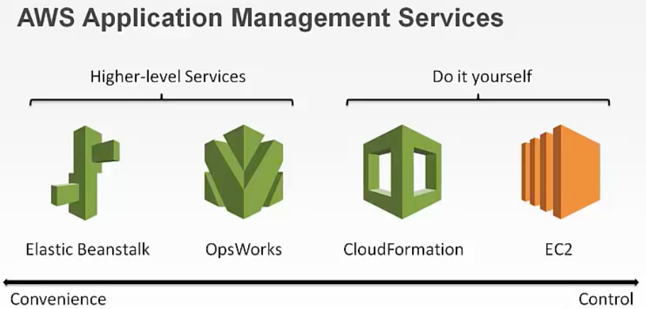

# Intro to DevOps

## Week 2 Day 1, Monday, April 9th, 2018

### What is Chef?
- An open-source automation platform that configures and manages infrastructure, like software deployment.

### How does Chef work?
1. Lets start with the Chef server. It manages the nodes that make up your infrastructure. What are nodes? A node can be a physical server, VM, your local laptop, or anything in your computing environment.
2. The Chef Server stores the current and desired configuration instructions of the nodes, called cookbooks. These "pluggable" cookbooks are made up of custom recipes, which implement policies or instructions that fit your needs and are then uploaded to Chef Server.

3. Chef Server is a centralized store for all infrastructure information, sort of like the store in a Redux cycle, which holds the current application state.
3. The Chef Client runs on each node, and regularly checks in with Chef Server to see if there are any changes in the cookbooks or settings. If there are, Chef Server sends the latest versions and Chef Client applies the configuration changes to the node.

    - If it helps, a Chef Client can be analogous to a React container, which configures (or maps) any changes in the state as props. The store (or Chef Server) sends latest application state to the container (or Chef Client), the container configures those changes, and maps them to props, which are then applied to the presentational components (or nodes).


### Chef Setup and Berkshelf
- Uses Ruby as Domain Specific Language (DSL)
- Each "step" in the script is modeled as a "resource".
- Berkshelf is one particular public cookbook repo, and its usage installs the Berkshelf client on your node.
- But why Berkshelf?? I'm not sure, but in this case, we're using Berkshelf.

- Berksfile contains only the location to the public Chef cookbook repos available in the "Chef Supermarket", lol...
- Dependencies are listed in metadata.rb and run ```berks vendor ..```  in ```cookbooks/my_cookbook``` directory to properly download cookbooks locally.


### Ok, so how does AWS OpsWorks come into this discussion?
- Lets start with, "What is OpsWorks?"
    - AWS OpsWorks is a DevOps application management service. In other words, this service focuses on automating operational tasks, like software configurations, server scaling, deployments, and DB setups for your app.
    - Can even automate operations like auto scaling and health monitoring.
    - There are multiple ways to deploy apps on AWS, such as Elastic Beanstalk, CloudFormation, EC2. And OpsWorks is another option.

        - It all comes down to level of convenience.

        


- How does OpsWorks, work?
    - Model your entire application as a **stack**, consisting of **layers**. **Layers** are like blueprints that define how to setup and configure EC2 instances. For example, OpsWorks offers pre-built layers for Ruby and AWS RDS.
    - Once layers are setup and configured, and your stack is ready, OpsWorks pulls the code from your repo, and deploys it onto your instances to get your stack up and running, using the predefined layers.
    - In the grand scheme of things, when a deploy is triggered in CI build/deploy pipeline using Jenkins, a deployment system like Chef comes into play, which is responsible for configuring the **layers** within the stack, which is modeled after your application.
    - In the grander scheme, OpsWorks integrates with the lifecycle of AWS EC2 instances.


### How does OpsWorks with Chef?
- Recipes are scripts for OpsWorks to run.
- OpsWorks triggers events during an application lifecycle, such as when an instance is setup, or an app is deployed. The OpsWorks lifecycle events consist of the following.
    1. setup
    2. configure
    3. deploy
    4. undeploy
    5. shutdown


- **Layers can be defined on your own, and can be configured however you want, using Chef recipes.**
- **You can perform specific configuration tasks using Chef recipes that are attached to those events.**
- **Whenever a change happens on your stack, or upon request, all instances are notified and recipes are run.**

- We're focusing on 2 of the 5 lifecycles with two written recipes, or scripts:
    - ```setup.rb```, which contains 5 things:
        1. included recipes (recipes that need to be run from other cookbooks)
        2. Apt dependencies (i.e. machine level dependencies that need to be installed before running app)
        3. Init.d service (a service that enables starting and stopping of a long running app)
        4. Nginx config (our web server)
        5. Unicorn config (our production app server, setup unix socket to open lines of communication between Unicorn and Nginx)
    - ```deploy.rb```, which contains 2 things:
        1. Git (allows Git checkout of latest version of Master branch)
        2. dependency installs (i.e. bundle, npm, compile webpack and rails assets)


### Additional Resources
[AWS OpsWorks Overview and Demo w/ Chef](https://www.youtube.com/watch?v=cj_LoG6C2xk) - 15min YT video
